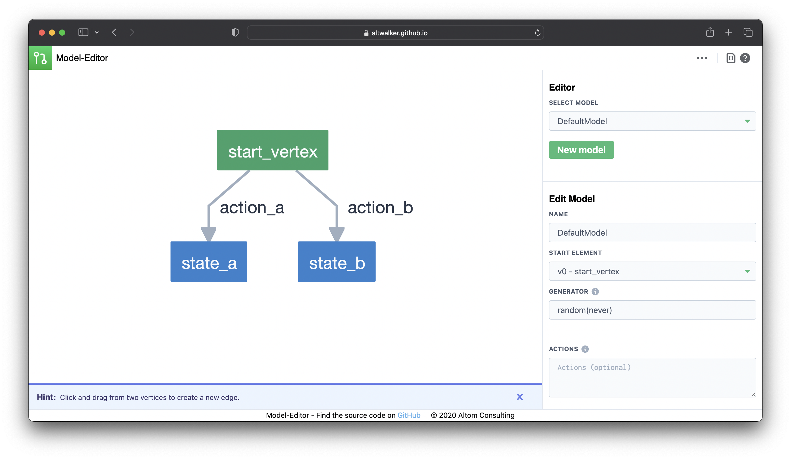

# ModelEditor

A web based editor and visualizer for AltWalker and GraphWalker models.

Visit the app at https://altwalker.github.io/model-editor.



## Models Format

For more information about the models format you can visit the [AltWalker documentation](https://altwalker.github.io/altwalker/core/modeling.html) or [Graphwalker documentation](https://github.com/GraphWalker/graphwalker-project/wiki/JSON-file-format).

## Prerequisites

You will need the following things properly installed on your computer.

* [Git](https://git-scm.com/)
* [Node.js](https://nodejs.org/) (with npm)
* [Ember CLI](https://ember-cli.com/)
* [Google Chrome](https://google.com/chrome/)

## Installation

* `git clone https://github.com/altwalker/model-editor.git`
* `cd model-editor`
* `npm install`

## Running / Development

* `ember serve`
* Visit your app at [http://localhost:4200](http://localhost:4200).
* Visit your tests at [http://localhost:4200/tests](http://localhost:4200/tests).

### Code Generators

Make use of the many generators for code, try `ember help generate` for more details

Make sure to use the new ember octaine components:

```bash
# -gc stands for glimmer component
$ ember generate component my-component -gc
```

### Running Tests

* `ember test`
* `ember test --server`

### Linting

* `npm run lint:hbs`
* `npm run lint:js`
* `npm run lint:js -- --fix`

### Building

* `ember build` (development)
* `ember build --environment production` (production)

### Deploying

Check the [deploy.yml](.github/workflows/deploy.yml) file.

## Support

Join our [Gitter chat room](https://gitter.im/altwalker/community) or our [Google Group](https://groups.google.com/g/altwalker) to chat with us or with other members of the community.

## Further Reading/Useful Links

* [ember.js](https://emberjs.com/)
* [ember-cli](https://ember-cli.com/)
* Development Browser Extensions
  * [ember inspector for chrome](https://chrome.google.com/webstore/detail/ember-inspector/bmdblncegkenkacieihfhpjfppoconhi)
  * [ember inspector for firefox](https://addons.mozilla.org/en-US/firefox/addon/ember-inspector/)

## License

This project is licensed under the [GNU General Public License v3.0](LICENSE).
